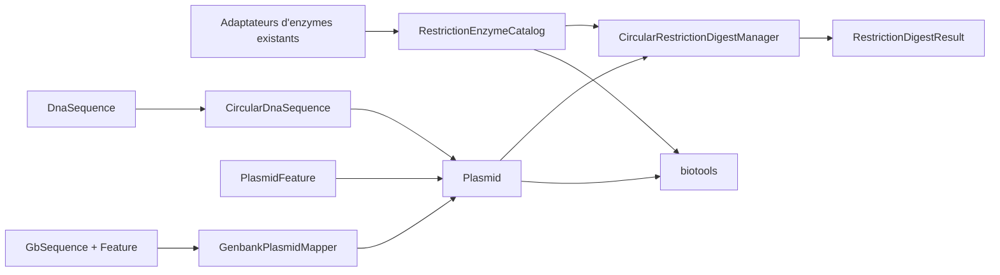

# BioPHP — socle « plasmides et clonage » pour Claude Code

> Statut : spécification prête à être implémentée, par lots indépendants.  
> Dépôt concerné : `amelaye/biophp`.  
> Source d’inspiration, en lecture seule : `../../plasmidb-0.9.1/`.  
> Dépôts consommateurs : `../../biotools/`, puis `../../biophp-demo/`.

## Instruction principale pour Claude Code

Lis intégralement `CLAUDE.md`, puis cette spécification, avant toute modification. Implémente un seul lot à la fois. Ne modifie jamais `../../plasmidb-0.9.1/` et ne copie pas son architecture PHP 5. Les nouveaux éléments de BioPHP doivent être des primitives métier réutilisables, indépendantes des formulaires, de Twig, des contrôleurs et de la persistance applicative.

Avant chaque lot :

1. inspecter le code et les tests actuels concernés ;
2. annoncer les fichiers qui seront ajoutés ou modifiés ;
3. préserver toutes les API publiques existantes ;
4. écrire les tests avant ou avec l’implémentation ;
5. exécuter les tests ciblés, puis toute la suite ;
6. s’arrêter à la fin du lot et rendre un compte rendu vérifiable.

Commande conseillée depuis ce dépôt :

```text
Lis CLAUDE.md et FEATURES_PLASMIDB_CLAUDE.md. Réalise uniquement le lot BIOPHP-1,
avec ses tests et sa documentation. N'entame pas le lot suivant.
```

## 1. Rôle de BioPHP dans cette évolution

BioPHP doit fournir le socle scientifique et les objets de domaine :

- définitions normalisées d’enzymes de restriction ;
- séquences ADN circulaires ;
- plasmides annotés et features orientées ;
- digestion correcte d’une molécule circulaire ;
- extrémités produites par une digestion et compatibilité de ligation ;
- conversion contrôlée d’un enregistrement GenBank circulaire vers un plasmide.

BioPHP ne doit pas contenir :

- les formulaires Symfony de conception d’amorces ;
- les pages HTML ou SVG finales ;
- les recettes de PCR ;
- les scénarios utilisateurs de clonage ;
- la gestion de stocks, clones ou expériences de laboratoire ;
- les appels directs à des services BLAST ou Clustal distants.

Ces responsabilités appartiennent respectivement à `biotools`, `biophp-demo` ou à une future application LIMS séparée.

## 2. Capacités existantes à réutiliser

Ne pas recréer ce qui existe déjà :

| Besoin | Élément actuel |
|---|---|
| ADN, ARN et protéines immuables | `Domain/Sequence/ValueObject/*Sequence.php` |
| Complément et complément inverse | `AbstractNucleicSequence` |
| Séquences et traduction | `SequenceManager` et `SequenceBuilder` |
| Recherche de motifs | `SequenceManager::patPos()`, `patPoso()` et `findPattern()` |
| Digestion linéaire simple | `RestrictionEnzymeManager::cutSeq()` |
| Données Type II, IIb et IIs | DTO et adaptateurs dans `Api/` |
| Topologie GenBank | `GbSequence::getTopology()` |
| Features GenBank | `Domain/Sequence/Entity/Feature` |
| Parsing GenBank et EMBL | `Domain/Parser/Service/ParseGenbankManager` et `ParseEmblManager` |

Le nouveau code doit composer ces objets. Il ne doit pas dupliquer les tables d’enzymes ni introduire une seconde logique de complément IUPAC.

## 3. Conventions transversales

### 3.1 Coordonnées

Deux conventions coexistent déjà et doivent être rendues explicites :

- les opérations primitives sur une chaîne PHP restent indexées à partir de zéro ;
- les features biologiques d’un plasmide utilisent des coordonnées **1-based inclusives**.

Toute méthode publique doit préciser sa convention dans son nom ou sa PHPDoc. Une conversion ne doit avoir lieu qu’à la frontière entre les deux modèles.

Pour un plasmide circulaire, une feature dont `start > end` traverse l’origine. Exemple : `start=4900`, `end=100` sur une molécule de 5000 bases est valide.

### 3.2 Immutabilité

Les nouvelles séquences, définitions d’enzyme, extrémités et annotations doivent être immuables. Une transformation retourne un nouvel objet. Les entités Doctrine actuelles ne doivent pas être transformées en value objects.

### 3.3 Erreurs

- Une entrée impossible ou incohérente lève une exception de domaine précise.
- Une recherche sans résultat normal, comme « aucune enzyme de ce nom », retourne `null` ou un résultat vide selon l’interface documentée.
- Ne pas attraper `\Exception` pour la relancer sous forme de `\Exception` générique.
- Les messages doivent contenir la valeur fautive et la règle violée, sans inclure de séquence complète potentiellement volumineuse.

### 3.4 Dépendances et tests

- PHP minimum : 8.2 ; CI jusqu’à PHP 8.5.
- Configuration des services : XML, dans le répertoire `Resources/config` du domaine concerné.
- Aucun appel HTTP réel dans les tests.
- Les adaptateurs d’API doivent être simulés à partir de fixtures locales.
- Ne pas ajouter de dépendance Composer pour une opération réalisable avec les primitives du projet.

## 4. Architecture cible



Les noms ci-dessous sont des noms cibles. Claude Code peut les ajuster si une convention existante du dépôt l’exige, mais doit expliquer tout écart.

---

## Lot BIOPHP-1 — catalogue normalisé des enzymes de restriction

### Objectif

Offrir à `biotools` une API typée pour récupérer une enzyme par nom, sans accéder aux tableaux privés de `RestrictionDigestManager` et sans recopier les données de `bioapi`.

### Nouveaux objets proposés

```text
Domain/Sequence/ValueObject/RestrictionEnzymeDefinition.php
Domain/Sequence/Interfaces/RestrictionEnzymeCatalogInterface.php
Domain/Sequence/Service/RestrictionEnzymeCatalog.php
Domain/Sequence/Exception/UnknownRestrictionEnzymeException.php
```

### `RestrictionEnzymeDefinition`

Propriétés minimales :

- `name` : nom canonique ;
- `aliases` : isoschizomères ou noms partageant le motif ;
- `family` : `TYPE_II`, `TYPE_IIB` ou `TYPE_IIS`, sous forme de constantes ;
- `recognitionPattern` : notation humaine conservant les marques de coupure ;
- `computingPattern` : motif destiné à la recherche ;
- `recognitionLength` ;
- `cleavagePositionUpper` ;
- `cleavagePositionLower` ;
- `nonAmbiguousBaseCount`.

L’objet doit :

- valider son nom et ses longueurs ;
- exposer une séquence de reconnaissance nettoyée, sans `'` ni `_` ;
- indiquer s’il contient des bases ambiguës ;
- ne pas tenter de calculer une extrémité sans séquence cible ;
- ne jamais dépendre de HTML ou de Doctrine.

### `RestrictionEnzymeCatalogInterface`

Comportements attendus :

```php
public function findByName(string $sName): ?RestrictionEnzymeDefinition;
public function getByName(string $sName): RestrictionEnzymeDefinition;
public function findByFamily(string $sFamily): array;
public function findByRecognitionSequence(string $sSequence): array;
```

Règles :

- recherche du nom insensible à la casse ;
- recherche possible par alias ;
- résultat déterministe et trié ;
- `getByName()` lève `UnknownRestrictionEnzymeException` ;
- fusion des trois familles sans perte des positions de coupure ;
- déduplication par nom canonique, pas par motif seul.

### Tests obligatoires

- récupération par nom canonique ;
- récupération par alias et casse différente ;
- distinction Type II / IIb / IIs ;
- enzyme inconnue ;
- enzyme contenant des symboles IUPAC ;
- conservation des deux positions de coupure ;
- absence d’appel réseau grâce aux adaptateurs simulés ;
- ordre stable des résultats.

### Critères d’acceptation

- interface publique documentée ;
- service déclaré dans le XML et aliasé vers son interface ;
- aucune modification cassante des DTO ou adaptateurs actuels ;
- suite complète de BioPHP verte.

---

## Lot BIOPHP-2 — ADN circulaire

### Objectif

Représenter correctement une séquence circulaire et les opérations qui franchissent son origine.

### Fichiers proposés

```text
Domain/Sequence/ValueObject/CircularDnaSequence.php
Tests/Domain/Sequence/ValueObject/CircularDnaSequenceTest.php
```

`CircularDnaSequence` peut étendre `DnaSequence` si cela respecte les invariants existants. Elle doit au minimum fournir :

```php
public function rotateTo(int $iPosition): self;
public function sliceCircular(int $iStart, int $iLength): DnaSequence;
public function positionModulo(int $iPosition): int;
```

Convention de ces trois méthodes : index à partir de zéro, conformément à `subSequence()`.

### Règles

- une séquence circulaire vide est refusée ;
- les positions négatives sont normalisées modulo la longueur ;
- les positions supérieures à la longueur sont normalisées de la même façon ;
- une tranche peut traverser l’origine ;
- une longueur négative est refusée ;
- une longueur supérieure à celle du plasmide est permise uniquement si le comportement de répétition est explicitement demandé. Pour la première version, la refuser afin d’éviter une ambiguïté silencieuse ;
- rotation de zéro ou d’un multiple de la longueur : séquence identique.

### Tests obligatoires

- rotation simple ;
- rotation négative ;
- rotation supérieure à la longueur ;
- tranche sans franchissement ;
- tranche franchissant l’origine ;
- longueur zéro ;
- séquence vide et longueur invalide ;
- conservation des symboles IUPAC.

---

## Lot BIOPHP-3 — agrégat plasmide et annotations

### Objectif

Créer un modèle de plasmide indépendant de la base de données et suffisamment riche pour la conception, la digestion et le rendu graphique.

### Fichiers proposés

```text
Domain/Cloning/ValueObject/Plasmid.php
Domain/Cloning/ValueObject/PlasmidFeature.php
Domain/Cloning/ValueObject/FeatureType.php
Domain/Cloning/ValueObject/Strand.php
Domain/Cloning/Exception/InvalidFeatureCoordinatesException.php
```

Utiliser des classes à constantes plutôt que des enums si cela correspond mieux au style actuel.

### `Plasmid`

Propriétés :

- nom non vide ;
- `CircularDnaSequence` ;
- tableau ordonné de `PlasmidFeature` ;
- description facultative ;
- identifiant externe facultatif ;
- métadonnées libres facultatives, limitées à des scalaires ou tableaux sérialisables.

Méthodes :

- obtenir longueur et séquence ;
- ajouter une feature en retournant un nouveau plasmide ;
- filtrer les features par type ;
- extraire la séquence d’une feature ;
- tourner le plasmide à une nouvelle origine en recalculant les coordonnées ;
- détecter les noms de features dupliqués sans les interdire.

### `PlasmidFeature`

Propriétés :

- nom ;
- type ;
- début et fin 1-based inclusifs ;
- brin `FORWARD`, `REVERSE` ou `NONE` ;
- couleur facultative au format hexadécimal strict ;
- note et identifiant externe facultatifs.

Types minimaux :

- `INSERT` ;
- `CDS` ;
- `PROMOTER` ;
- `TERMINATOR` ;
- `MARKER` ;
- `REPORTER` ;
- `ORIGIN_OF_REPLICATION` ;
- `TAG` ;
- `RESTRICTION_SITE` ;
- `MISC_FEATURE`.

### Règles biologiques et de coordonnées

- toutes les coordonnées sont comprises entre 1 et la longueur du plasmide ;
- `start > end` signifie que la feature traverse l’origine ;
- la longueur tient compte du franchissement de l’origine ;
- l’extraction d’une feature sur le brin inverse retourne le complément inverse ;
- deux features peuvent se chevaucher ;
- une feature de longueur nulle est interdite ;
- le modèle ne déduit pas automatiquement un type depuis le nom.

### Tests obligatoires

- feature directe et inverse ;
- feature traversant l’origine ;
- coordonnées 1 et longueur maximale ;
- coordonnées hors limites ;
- chevauchements autorisés ;
- rotation du plasmide et déplacement de toutes les features ;
- extraction exacte de la séquence annotée.

---

## Lot BIOPHP-4 — digestion circulaire et extrémités

### Objectif

Calculer les sites et fragments d’une digestion sur un plasmide, en distinguant clairement molécule linéaire et circulaire.

### Fichiers proposés

```text
Domain/Cloning/ValueObject/RestrictionCut.php
Domain/Cloning/ValueObject/RestrictionEnd.php
Domain/Cloning/ValueObject/RestrictionFragment.php
Domain/Cloning/ValueObject/RestrictionDigestResult.php
Domain/Cloning/Service/CircularRestrictionDigestManager.php
Domain/Cloning/Service/RestrictionEndCompatibilityManager.php
```

### Résultat de digestion

Il doit exposer :

- plasmide source ;
- enzymes utilisées ;
- positions de reconnaissance ;
- positions de coupure des deux brins ;
- extrémité 5’, 3’ ou franche ;
- séquence du surplomb si elle est déterminable ;
- fragments, avec longueur, séquence et extrémités gauche/droite ;
- avertissements pour les motifs ambigus ou les coupures hors site.

### Règles circulaires essentielles

- zéro coupure : molécule circulaire non digérée, aucun faux fragment linéaire ;
- une coupure : un fragment linéaire de la longueur totale du plasmide ;
- `n` coupures distinctes : `n` fragments, jamais `n + 1` ;
- le dernier fragment relie la dernière coupure à la première en traversant l’origine ;
- les positions dupliquées provenant d’isoschizomères restent traçables mais ne créent pas de fragment vide ;
- l’ordre des fragments est déterministe, à partir de la plus petite position de coupure ;
- les motifs IUPAC sont supportés par une conversion contrôlée, jamais par injection brute dans une expression régulière.

### Compatibilité des extrémités

La compatibilité ne doit être calculée qu’à partir de `RestrictionEnd` :

- deux extrémités franches sont compatibles ;
- deux surplombs cohésifs sont compatibles s’ils ont le même type et des séquences complémentaires dans l’orientation attendue ;
- une extrémité 5’ et une extrémité 3’ ne sont pas compatibles ;
- une extrémité inconnue ou ambiguë produit un résultat indéterminé, pas un `true` optimiste.

Les conventions des positions `cleavagePosUpper` et `cleavagePosLower` doivent être verrouillées par des fixtures connues couvrant au minimum une coupure franche, une extrémité 5’ et une extrémité 3’. Ne pas déduire la formule sans ces tests.

### Tests obligatoires

- plasmide sans site ;
- site unique ;
- deux et trois sites ;
- site traversant l’origine ;
- deux enzymes coupant à la même position ;
- motif ambigu ;
- coupure franche, 5’ et 3’ ;
- compatibilité positive, négative et indéterminée ;
- somme des longueurs des fragments égale à la longueur du plasmide.

---

## Lot BIOPHP-5 — import GenBank vers plasmide

### Objectif

Transformer les résultats des parsers existants en `Plasmid` lorsque la topologie est circulaire.

### Fichier proposé

```text
Domain/Cloning/Service/GenbankPlasmidMapper.php
```

### Règles de mapping

- refuser par défaut un enregistrement explicitement `LINEAR` ;
- accepter `CIRCULAR` sans modifier sa séquence ;
- mapper les clés GenBank usuelles vers `FeatureType` ;
- conserver le type original dans les métadonnées ;
- conserver labels, produit, gène et notes utiles sans concaténation opaque ;
- préserver le brin et les features `complement(...)` ;
- préserver les features traversant l’origine et les emplacements joints quand ils peuvent être représentés ;
- produire un avertissement documenté pour un emplacement complexe non représentable, plutôt que de le tronquer silencieusement.

Le parseur GenBank lui-même ne doit être modifié que si un test démontre une perte d’information en amont.

### Tests obligatoires

- petit fixture GenBank circulaire ;
- mapping promoteur, CDS, marqueur et origine ;
- feature inverse ;
- feature traversant l’origine ;
- rejet d’un record linéaire ;
- emplacement complexe signalé.

---

## 5. Fonctionnalités explicitement hors périmètre de BioPHP

Les éléments suivants peuvent être inspirés de Plasmi::db mais ne doivent pas entrer dans ce dépôt :

- conception et classement de paires d’amorces ;
- ajout de clamps, tags ou queues de clonage ;
- recette de master mix PCR ;
- dessin SVG ;
- formulaires et validations Symfony ;
- inventaire de laboratoire ;
- authentification, sessions et permissions ;
- pièces jointes de cartes PDF ou fichiers de séquençage ;
- clients SOAP historiques BLAST/Clustal.

## 6. Code Plasmi::db à ne pas porter tel quel

Ne pas reprendre :

- `Phli/`, les contrôleurs scaffoldés et `DB_DataObject` ;
- les fonctions qui produisent directement du HTML ;
- les vecteurs et tags codés en dur dans `PrimerGenerator.php` ;
- les méthodes marquées `NotImplementedException` ;
- les anciens clients SOAP en HTTP ;
- les accès globaux, variables implicites et indices de tableaux non quotés.

La logique utile de `Bio/Bio/SeqUtils/SeqUtils.php` peut servir à comprendre l’intention de sélection d’amorces, mais cette fonctionnalité sera réécrite dans `biotools` en utilisant son calcul moderne de Tm.

## 7. Licence et attribution

Le code historique est sous GPL v2 ou GPL v2-or-later selon les fichiers, et BioPHP est sous `GPL-2.0-only`. Si une portion identifiable de logique est adaptée :

- conserver une mention de provenance dans l’en-tête du fichier ;
- créditer Mark Brooks et les auteurs historiques concernés ;
- mettre à jour `CREDITS.md` ;
- ne jamais présenter le code historique comme une création originale ;
- préférer une réécriture testée lorsque le code source mélange logique, HTML et dépendances obsolètes.

## 8. Définition de « terminé » pour chaque lot

- [ ] API publique documentée et typée autant que le style du dépôt le permet.
- [ ] Aucun changement cassant non demandé.
- [ ] Tests unitaires des cas nominaux, limites et erreurs.
- [ ] Adaptateurs externes simulés ; aucun réseau pendant les tests.
- [ ] Services et alias déclarés dans le XML approprié.
- [ ] `php -l` exécuté sur chaque fichier PHP modifié.
- [ ] Tests ciblés verts.
- [ ] `vendor/bin/phpunit -c phpunit.xml` vert.
- [ ] README ou documentation publique mise à jour si une API est livrée.
- [ ] Aucun changement dans `Legacy/`, `../../plasmidb-0.9.1/`, `vendor/`, `build/` ou `composer.lock`.

## 9. Ordre d’exécution recommandé

1. `BIOPHP-1` — catalogue typé des enzymes ;
2. publier ou rendre disponible cette version à `biotools` ;
3. `BIOPHP-2` — ADN circulaire ;
4. `BIOPHP-3` — plasmide et features ;
5. `BIOPHP-4` — digestion circulaire et extrémités ;
6. `BIOPHP-5` — import GenBank.

Ne pas regrouper les cinq lots dans une seule pull request. Chaque lot doit laisser le dépôt dans un état publiable.
